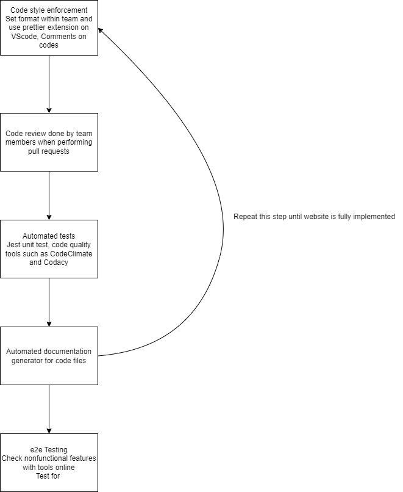

# Phase 1 Pipeline Plans

## Linting and Code Style
For code style, our team has discussed a format that all of our coders will apply, we will make sure that all of the codes that we write will be in the same format. To ensure this, we have decided to use the prettier extension on VSCode to make sure that our code is clean and readable for all of our group members. Moreover, we are attempting to add an automated code listing method to our workflow so that it will warn us everytime we push and pull requests upon commit and pull requests. However, we are struggling to make the linting automation work in the workflow, but we are aiming to accomplish it in the near future.

## Code quality via tool
For this part, we are trying to see which tool best fits us between CodeClimate and Codacy. However, since we don't have much of the code done yet, we are still trying to figure out how these codes will ensure our code quality and see which one will fit us better. If both of the applications are able to assist us on code quality, we will use both of them or even more similar tools like this to enhance our code quality.

## Code quality via human review
For this part of the CI/CD pipeline, we will just simply check for errors and review our code during pull requests to make sure that nothing gets too messy between pull requests.

## Unit test
We have decided to utilize the Jest unit test for our project, so far we have successfully added the Jest files needed to perform basic unit tests like the ones we did in lab 5. As the project progresses, we will use Jest to perform more unit tests to ensure that our files work in the way that we want to. As well as making sure that all of our features will work properly to ensure ideas like usability and accessibility.

## Documentation
Our group wants to make sure that all of our codes are easily readable, and increase code reproducibility, as well as usability. Hence we are trying to add automated documentation tools on GitHub workflow. So far we are having trouble making the documentations automatically everytime we push, but we are able to create documentations locally before our pushes. In the future, we hope to have this process entirely automated so it will generate documentation of our code every time we push something new to our branches. Which allows other group members to know what each function should do even if they don't know the logic behind the functions.

## e2e testing and other testing
So far for e2e testing, all we have planned is that we want to test our journal website at the end to ensure that the website functions properly as our group expects. We will test the entire website with different aspects such as using tools like LightHouse or online tools that would rate our website's different aspects. Such as performance, usability, accessibility, we want to make sure that we can have ratings as high as possible so that the users are able to use our website for their convenience and attain high satisfaction. We will also test the features ourselves on different devices and under different situation to ensure that our website will function properly under different circumstances.

## Pipeline Diagram

