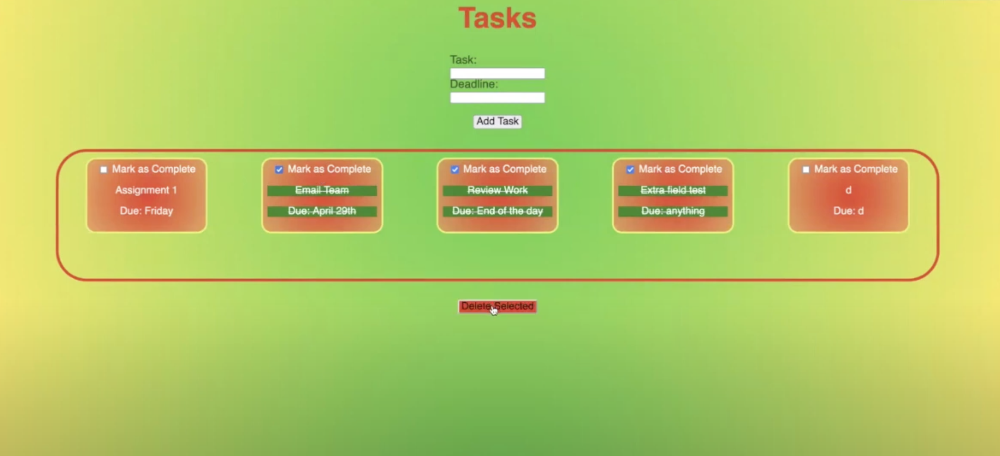
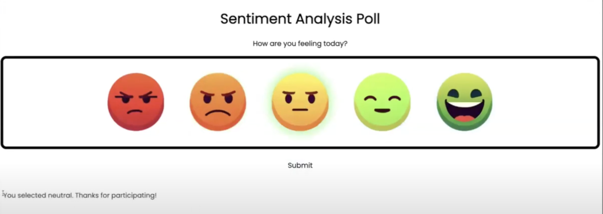
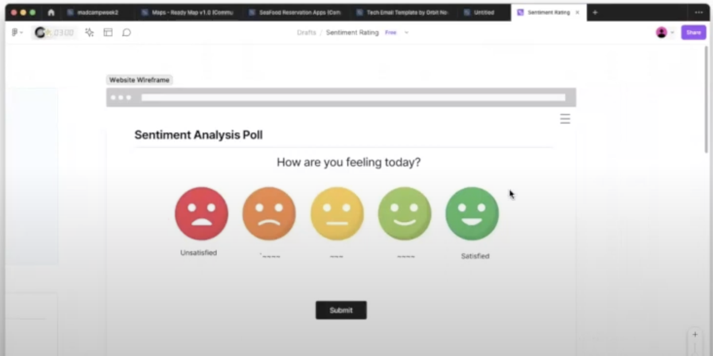
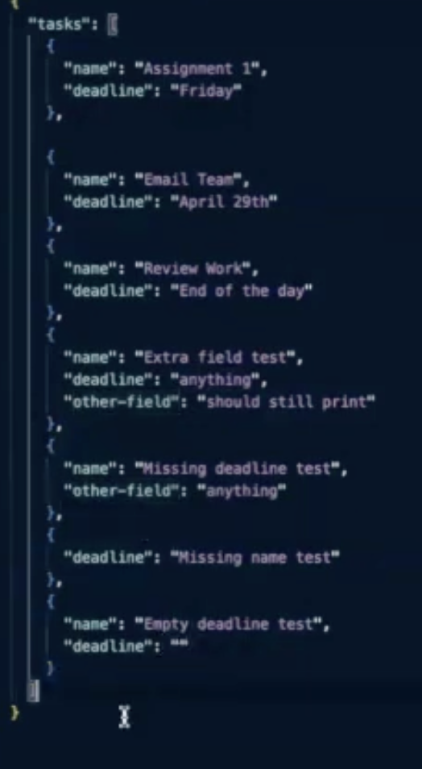
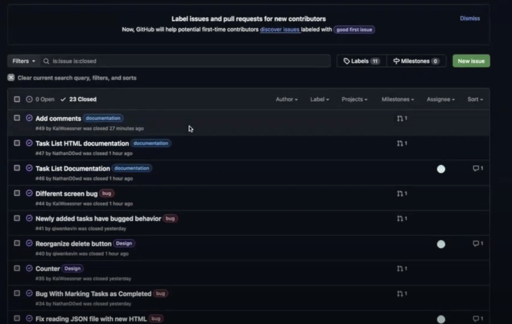

# Team 25
## Sunday April 28, 2024
# Sprint Review Meeting: Warmup
### Meeting held online through Zoom

# Attendence
Bobby
Chris
Nathan
Andrew
Kai
Justin
Derek

## Agenda
Discuss Warmup Execution
Overview our Accomplishments

## Discuss Warmup Execution

  

  
## Overview our Accomplishments
We designed a functional task list and sentiment analysis widget in a week

  
  

Before coding, we brainstormed possible designs

  

We tested the designs to improve them

  

We utilized pull requests in Github to assist in the coding process

  

