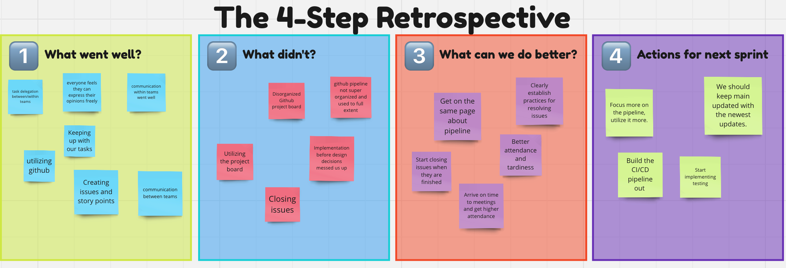

# Team 25
## Friday, 12:30PM May 24, 2024

# Weekly Meeting
### Meeting held in 1st floor Geisel West

### Attendance (7/10)
- Chris
- Bobby
- Kai
- Nathan
- Justin
  
### Absent
- Andrew
- Sonya
- Derek
- Sahana
- Kevin

## Agenda
1. Sprint review

### Sprint Review

#### SWOT analysis
Strengths：
- communication between teams
- psychological safety, everyone felt safe expressing themselves
- everyone had a say in the design and decision making
- communication within teams, delegation of tasks within teams, everyone knows what their team is doing
- pretty good consistency with coding styles, documentation
- technical progress going well, incremental improvements
- github issues, reviewing
- Task delegation was good, task prioritization
  
Weaknesses：
- CI pipeline isn’t great; team doesn’t all have a super clear vision of the pipeline
- More involvement with project board
- Not addressing github issues stuff
- Design decisions before
  
Opportunities：
- more focus into and using the pipeline
- main stays updated with best version
- more assigning, linked with issues, closing issues, updating project board

Threats：
- attendance and tardiness

# Retrospective Board

