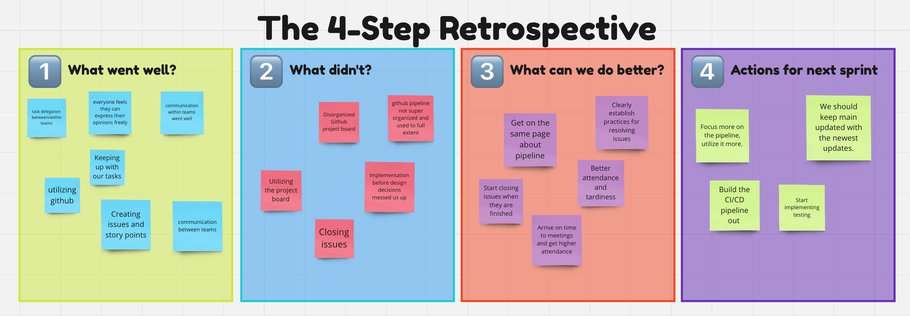

# Team 25
# Friday 12:30PM, June 7, 2024 

# Final Sprint Review & Retrospective
### Meeting held in Geisel 1st Floor West

### Attendance (6/10)
- Bobby
- Chris
- Derek
- Sonya
- Kai
- Justin

### Absent
- Nathan
- Sahana
- Kevin
- Andrew

## SWOT Analysis
### Strengths:
- Planned and designed before we implemented; spent significant time on this part before moving forward
- Splitting up into teams was efficient, more manageable
- Everyone carried their weight and was reliable
- Everyone had input and each opinion was considered
- Github pipeline and actions were done well
- Communication was great, within teams and between teams; utilizing Slack, Github comments, and in-person meetings

### Weaknesses
- Some unnecessary backtracking; ie implementing something, then refactoring, then re-implementing
- Messy Github repo; too many branches and issues
- Differing code style somewhat
- Pipeline was finalized a little late into the project

### Opportunities
- More structured pipeline
- Responsiveness of the website at smaller screens isn’t great
- A universal search function for searching for past journal entries, tasks, etc.

### Threats
- Our storage system is fairly small; performance would slow down with upward scaling
- On slow, low-capability mobile phones, website slows down significantly

# Retrospective

